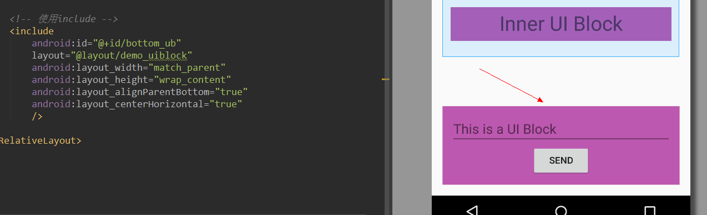
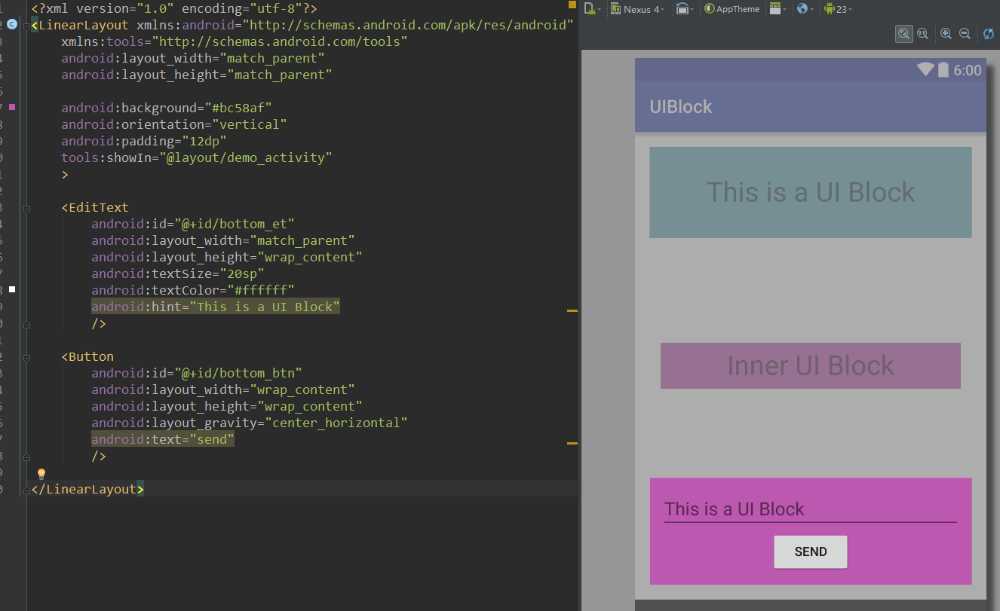
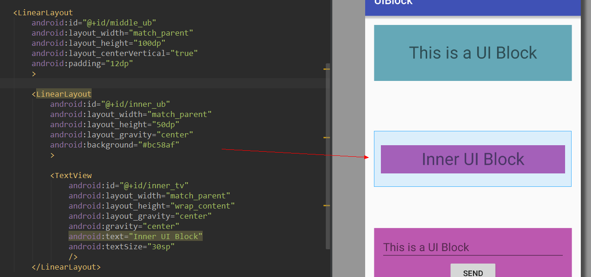

# UIBlock  
代替fragment的轻量级解耦UI的类  

## 添加依赖  
1.在项目外层的build.gradle中添加JitPack仓库
  
```  
repositories {
	maven {
		url "https://jitpack.io"
	}
}
```    
2.在用到的项目中添加依赖  

```  
dependencies {
		compile 'com.github.tianzhijiexian:UIBlock:1.0.1'
}    
```   

## 准备工作  
在项目中建立一个BaseActivity，让它实现ContainUIBlockActivity接口：  

```JAVA
package kale.ui.base;

import android.content.Intent;
import android.os.Bundle;
import android.os.PersistableBundle;
import android.support.annotation.CallSuper;
import android.support.v7.app.AppCompatActivity;

import kale.ui.uiblock.ContainUIBlockActivity;
import kale.ui.uiblock.UIBlockManager;

/**
 * @author Jack Tony
 * @date 2015/9/21
 */
public class BaseActivity extends AppCompatActivity implements ContainUIBlockActivity {

    private UIBlockManager mUIBlockManager;

    @Override
    public UIBlockManager getUIBlockManager() {
        if (mUIBlockManager == null) {
            mUIBlockManager = new UIBlockManager(this);
        }
        return mUIBlockManager;
    }

    @CallSuper
    @Override
    public void onSaveInstanceState(Bundle outState, PersistableBundle outPersistentState) {
        super.onSaveInstanceState(outState, outPersistentState);
        if (mUIBlockManager != null) {
            mUIBlockManager.onSaveInstanceState(outState, outPersistentState);
        }
    }

    @CallSuper
    @Override
    public void onRestoreInstanceState(Bundle savedInstanceState) {
        super.onRestoreInstanceState(savedInstanceState);
        if (mUIBlockManager != null) {
            mUIBlockManager.onRestoreInstanceState(savedInstanceState);
        }
    }

    @CallSuper
    @Override
    public void onStart() {
        super.onStart();
        if (mUIBlockManager != null) {
            mUIBlockManager.onStart();
        }
    }

    @CallSuper
    @Override
    public void onResume() {
        super.onResume();
        if (mUIBlockManager != null) {
            mUIBlockManager.onResume();
        }
    }

    @CallSuper
    @Override
    public void onPause() {
        super.onPause();
        if (mUIBlockManager != null) {
            mUIBlockManager.onPause();
        }
    }

    @CallSuper
    @Override
    public void onStop() {
        super.onStop();
        if (mUIBlockManager != null) {
            mUIBlockManager.onStop();
        }
    }

    @CallSuper
    @Override
    public void onRestart() {
        super.onRestart();
        if (mUIBlockManager != null) {
            mUIBlockManager.onRestart();
        }
    }

    @CallSuper
    @Override
    public void onDestroy() {
        super.onDestroy();
        if (mUIBlockManager != null) {
            mUIBlockManager.onDestroy();
        }
    }
    
    @CallSuper
    @Override
    public void onBackPressed() {
        if (mUIBlockManager != null) {
            if (!mUIBlockManager.onBackPressed()) {
                super.onBackPressed();
            }
        }
    }

    @CallSuper
    @Override
    public void onActivityResult(int requestCode, int resultCode, Intent data) {
        super.onActivityResult(requestCode, resultCode, data);
        if (mUIBlockManager != null) {
            mUIBlockManager.onActivityResult(requestCode, resultCode, data);
        }
    }

}

```     
可以看到这里面就是在activity的回调时调用mUIBlockManager的对应的方法。这里其实还有一个思路就是用（registerActivityLifecycleCallbacks）这个方法，但是因为application只能设置一个监听，如果开发者在自己的应用中也用了这个回调，我这里就监听不到了。其次就是hook，但这里可能要引入一个框架，故没尝试。因此，还是采用比较简单粗暴的手动在生命周期中调用相应方法的办法。  

## 使用情形  
**1. 简单划分UI逻辑，降低Activity复杂度**  
我们之前用fragment来拆分UI的逻辑的办法来提升程序可读性，降低activity的复杂度。但因此带来的是使用fragment出现的各种奇葩问题和fragment的复杂度。因此，我利用UIBlock实现了类似的功能，但复杂度远远降低。   
    
比如我这里只想把顶部的这个linearLayout的逻辑独立出来，但不想要独立写一个xml布局文件。要完成这个功能，我只需要建立一个UIBlock：  
```JAVA
public class DemoTopUIBlock extends UIBlock{

    @Override
    public int getRootViewId() {
        return R.id.top_ub;
    }

    TextView mTopTv;

    @Override
    protected void bindViews() {
        mTopTv = getView(R.id.top_tv);
    }

    @Override
    protected void setViews() {
        String content = mTopTv.getText().toString();
        mTopTv.setText(content + " :)");
    }
    
}
```   
接着，在activity中`getUIBlockManager().add(new DemoTopUIBlock())`，这样就使得这个linearLayout的逻辑转交给了UIBlock。  

**2. 复用有相似界面和相似逻辑的UI**  
复用UI是很常见的需求，但这里我的意见是：多复用UI组件，而不是复用activity。因为如果activity被多次复用，可能会因为后面设计师的界面分化，造成维护的难度。   
题外话说完了，来看看如何利用UIBlock做这样的复用吧。这样的复用很简单，直接用现成的`<include/>`标签即可，毫无技术性。   
     
来看看被include的布局长啥样（这里用到了`tools:showIn`这个小技巧）：
    
然后建立相应的UIBlock：  

```JAVA
public class DemoBottomUIBlock extends UIBlock{

    @Override
    public int getRootViewId() {
        return R.id.bottom_ub;
    }

    private EditText mBottomEt;
    private Button mBottomBtn;
    
    @Override
    protected void bindViews() {
        mBottomEt = getView(R.id.bottom_et);
        mBottomBtn = getView(R.id.bottom_btn);
    }

    @Override
    protected void setViews() {
        mBottomBtn.setOnClickListener(new View.OnClickListener() {
            @Override
            public void onClick(View v) {
                getActivity(DemoActivity.class).changeText();
            }
        });
    }

    public void onTextChangeCompleted(@NonNull String text) {
        mBottomEt.setText(text);
    }
}
```  
最后，在activity中引入这部分逻辑：`getUIBlockManager().add(new DemoBottomUIBlock())`  

**3. 嵌套使用UIBlock**  
之前`豪哥（大神）`提出过这样的需求，activity中套fragment，这个fragment中又套了一个fragment，这种嵌套的问题在fragment的世界中真是令人头疼。现在我们看看如何用UIBlock来简单解决这个问题。  
     
上面的代码中，LinearLayout中嵌套了一个LinearLayout，我希望外面的LinearLayout被一个UIBlock控制，内部的LinearLayout被另一个UIBlock控制，形成嵌套。废话不说，上外层的代码：
```JAVA
public class DemoMiddleUIBlock extends UIBlock{

    @Override
    public int getRootViewId() {
        return R.id.middle_ub;
    }

    @Override
    protected void bindViews() {
        getActivity(BaseActivity.class).getUIBlockManager().add(new DemoInnerUIBlock());
    }

    @Override
    protected void setViews() {
        getRootView().setBackgroundColor(0xff65a8b7);
    }
} 
```   
这里重要的一个方法是：`getActivity()`，可以通过这个方法得到activity的对象，然后直接调用activity的`getUIBlockManager()`来引入内层嵌套的UIBlock就行了。至于DemoInnerUIBlock的代码就不说了，和之前的类似。最后，不要忘记了在activity把这个UIBLock的代码引入进来`getUIBlockManager().add(new DemoMiddleUIBlock());`。   


### 开发者


Jack Tony: <developer_kale@qq.com>  


### License

    Copyright 2015 Jack Tony

    Licensed under the Apache License, Version 2.0 (the "License");
    you may not use this file except in compliance with the License.
    You may obtain a copy of the License at

       http://www.apache.org/licenses/LICENSE-2.0

    Unless required by applicable law or agreed to in writing, software
    distributed under the License is distributed on an "AS IS" BASIS,
    WITHOUT WARRANTIES OR CONDITIONS OF ANY KIND, either express or implied.
    See the License for the specific language governing permissions and
    limitations under the License.

