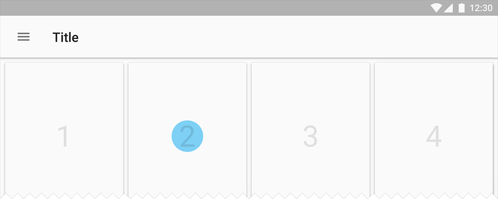

# UiBlock  
[](https://jitpack.io/#tianzhijiexian/UIBlock)

之前用fragment来降低activity的复杂度，但fragment带来的各种奇葩问题让我头疼。UiBlock实现了fragment的部分功能，复杂度极低，本质上就是一个自定义view。  

注意：UiBlock的所有生命周期和activity完全保持一致  

## 引入方式  
在项目外层的build.gradle中添加[插件](https://github.com/leolin310148/GradleAndroidAspectJPlugin)地址和JitPack仓库：
```  
buildscript {
    dependencies {
        classpath 'me.leolin:android-aspectj-plugin:1.0.7'
    }
}

allprojects {
	repositories {
		// ...
		maven { url "https://jitpack.io" }
	}
}
```    
在用到的项目中添加依赖和插件：  
> compile 'com.github.tianzhijiexian:UiBlock:[Latest release](https://github.com/tianzhijiexian/UIBlock/releases)'  
apply plugin: 'me.leolin.gradle-android-aspectj'

## 准备工作  
在项目中的BaseActivity(如果没有请自行建立)，让它实现`UiBlockActivity`接口：  

```JAVA
public class BaseActivity extends AppCompatActivity implements UiBlockActivity {

    private UiBlockManager mUiBlockManager;

    @Override
    public UiBlockManager getUiBlockManager() {
        if (mUiBlockManager == null) {
            mUiBlockManager = new UiBlockManager(this);
        }
        return mUiBlockManager;
    }
    
    @Override
    public UiBlockManager getInternalManager() {
        return mUiBlockManager;
    }
    
	// 下方均为activity的默认实现

    @Override
    public void onSaveInstanceState(Bundle outState) {
        super.onSaveInstanceState(outState);
    }

    @Override
    public void onRestoreInstanceState(Bundle savedInstanceState) {
        super.onRestoreInstanceState(savedInstanceState);
    }

    @Override
    public void onStart() {
        super.onStart();
    }

    @Override
    public void onResume() {
        super.onResume();
    }

    @Override
    public void onPause() {
        super.onPause();
    }

    @Override
    public void onStop() {
        super.onStop();
    }

    @Override
    public void onRestart() {
        super.onRestart();
    }

    @Override
    public void onDestroy() {
        super.onDestroy();
    }

    @Override
    public void onActivityResult(int requestCode, int resultCode, Intent data) {
        super.onActivityResult(requestCode, resultCode, data);
    }

    @Override
    public void onBackPressed() {
        super.onBackPressed();
    }
}
```     
在这里要写出activity默认的生命周期和`getUiBlockManager()`方法。写出默认的生命周期方法后就可以通过`AspectJ`来触发UiBlock的生命周期。

## 使用情形  
**1. 简单划分UI逻辑**  

  

这里的ui界面可以明显看出是由上下两个部分组成的。如果下方ui区块的代码很复杂，那么就可以利用UiBlock把下半部分的逻辑独立出来，并且不用写额外的xml布局文件。

1.建立UiBlock：
```JAVA
public class TextUiBlock extends UiBlock{

    @Override
    public int getLayoutResId() {
        return R.layout.demo_uiblock;
    }

    TextView text;

    @Override
    protected void bindViews() {
        text = getView(R.id.tv);
    }

    @Override
    protected void setViews() {
        mTopTv.setText("Share");
    }
}
```   
2.挂载到Activity上：  
在activity中，通过`getUiBlockManager().add(R.id.share_linearlayout, new TextUiBlock())`把UiBlock绑定到activity上。  

**2. 复用UI区块**  



复用UI是很常见的需求，我的建议是：多复用UI组件，而不是复用整个activity。因为如果activity被多次复用，一旦后期界面需求分化，就会造成维护难度。  

UiBlock可以用来做ui区块的复用：  
1. 建立一个要复用layout文件   
2. 建立对应的UiBlock  
3. 通过`include`将layout文件放入activity的xml中  
4. 调用UiBlockManager的add方法进行挂载(id就是include标签的id)  

```
<include
    android:id="@+id/uiblock_layout"
    layout="@layout/demo_uiblock"
    android:layout_width="match_parent"
    android:layout_height="100dp"
    />
```

**3. 嵌套使用UiBlock**  


之前`豪哥`遇到过这样的情况：activity中套fragment，这个fragment中又套了一个fragment。UiBlock可以很简单地解决这个问题。  

主要方法：  
1. 建立两个UiBlock  
2. 在activity中调用UiBlockManager的add方法挂载外层的UiBlock  
3. 在外层的UiBlock中调用UiBlockManager的add方法挂载内层的UiBlock  

## 详细文档
https://jitpack.io/com/github/tianzhijiexian/UiBlock/-SNAPSHOT/javadoc/

### 开发者


Jack Tony: <developer_kale@foxmail.com>  

### License

    Copyright 2016 Jack Tony

    Licensed under the Apache License, Version 2.0 (the "License");
    you may not use this file except in compliance with the License.
    You may obtain a copy of the License at

       http://www.apache.org/licenses/LICENSE-2.0

    Unless required by applicable law or agreed to in writing, software
    distributed under the License is distributed on an "AS IS" BASIS,
    WITHOUT WARRANTIES OR CONDITIONS OF ANY KIND, either express or implied.
    See the License for the specific language governing permissions and
    limitations under the License.
